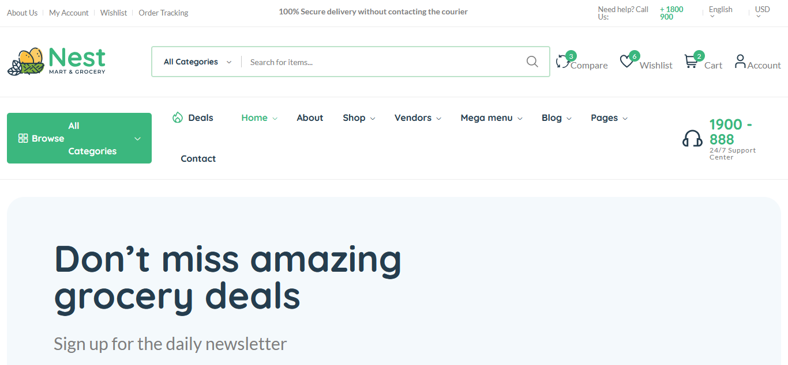
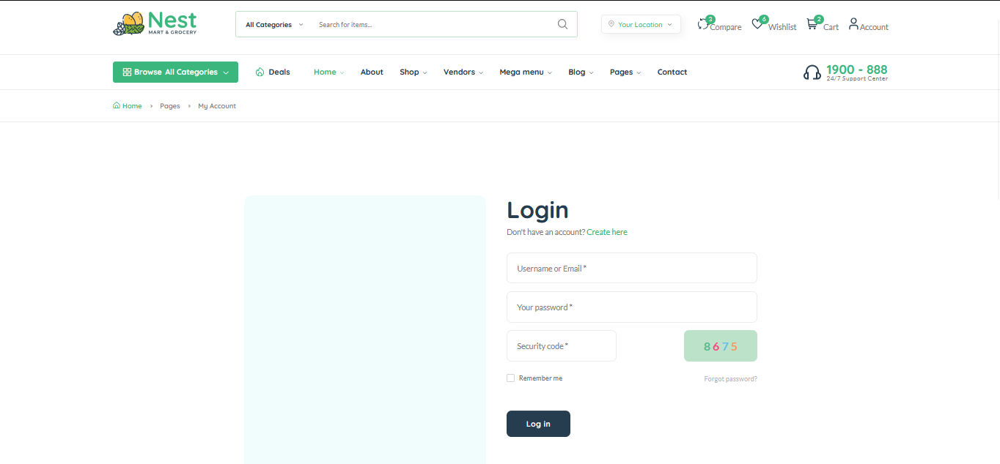
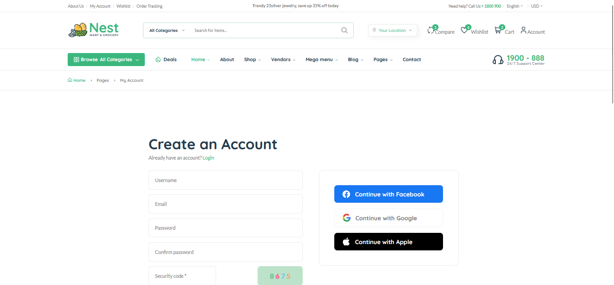

# laravel_small_shop

This is a simple e-commerce application built with Laravel. The project focuses on three main components: **Product**, **Cart**, and **Order**.

### Key Features:
- **Product Management**: Display products, categories, and product details.
- **Shopping Cart**: Allow users to add, update, or remove products in the cart.
- **Order Processing**: Manage customer orders, including checkout, payment, and order confirmation.

The application is designed to provide an intuitive and smooth shopping experience, from browsing products to completing orders.

### Home Page

### Login Page

### Register Page

